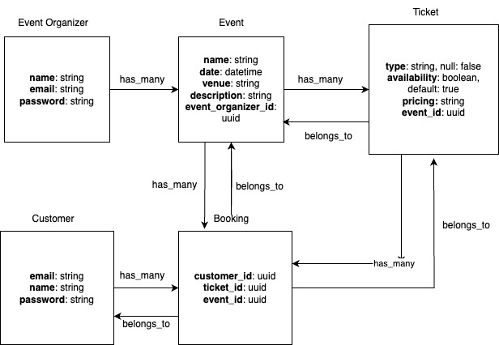
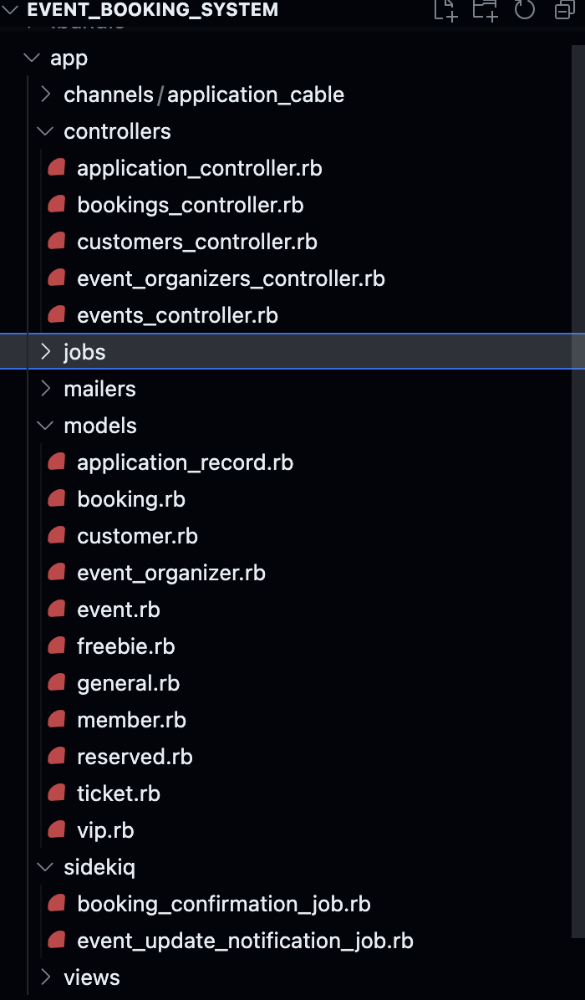
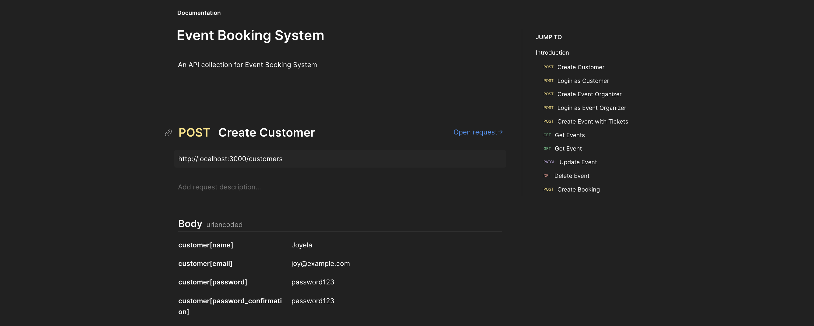
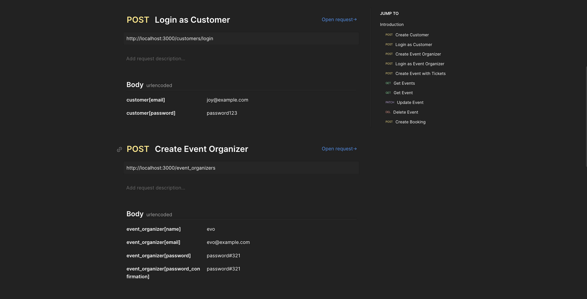
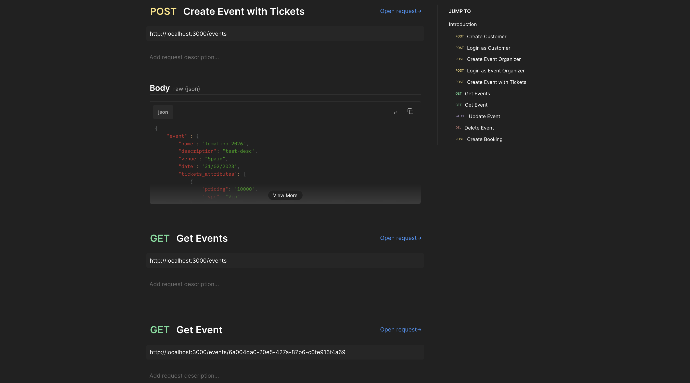
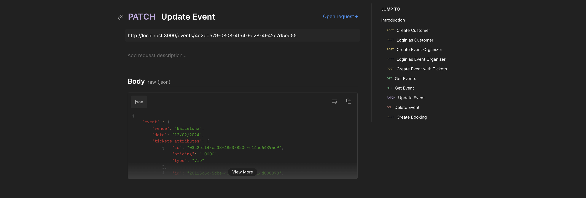
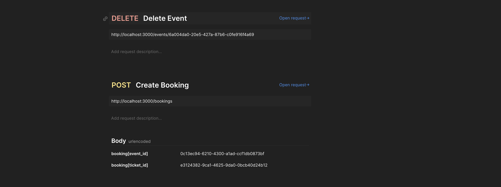

# Event Booking System

A simple backend for an event booking system.

API only application is hosted on https://event-booking-j7do.onrender.com and can be used for testing by referring to the "Endpoints" section at the end.


* Ruby version: 2.7.2
* Rails version: 6
* Database: Postgresql (pg '>= 0.18')

* Project Setup
  - Clone the repo
  ```
  git clone https://github.com/srijan-kapoor/event-booking-system.git
  ```
  - Move to directory
  ```
  cd event-booking-system
  ```
  - Run setup
  ```
  bin/setup
  ```
  - Start the server
  ```
  bundle exec rails s
  ```

* Services

  We are using `sidekiq` to trigger background jobs.
  A separate instance of sidekiq needs to be started to process these jobs.
  ```
    bundle exec sidekiq
  ```

### Directory Structure


The controller actions for signing up and logging the users can be found under `/controllers/event_organizers_controller.rb` and `/controllers/customers_controller.rb`

For event bookings `/controllers/bookings_controller.rb`

For creating events `/controllers/events_controller.rb`

This project makes use of STI for `Ticket` types. The following types of tickets are present at this point:

```
General
Vip
Reserved
Member
Freebie
```


### Autonomy and Time Management

- Project setup: Set a new Rails API only application with postgresql
- Design: 
  - Create a schema diagram depicting relationship between database entities
  - Based on the ER diagram, setup models, database(tables) and build necessary associations

- Authentication: Implement signup and login for two kinds of users: Event Organizers and Customers.
- Build APIs and corresponding controllers:
This includes designing the API endpoints, handling requests/ responses, and error handling.
  - Events: APIs to create, read, update, and delete events
  - Booking: Allow customers to book tickets

- Role-based Authorization: Restrict API access based on the user role: Event Organizer and Customer

- Background Tasks: Implement the Sidekiq jobs to send booking confirmations when a ticket is booked and to send email event update notifications to customers who have booked tickets for an event that gets updated.

### API Collection
A postman collection can be found [here](https://github.com/srijan-kapoor/event-booking-system/blob/0b558abfc192e44f7afcce9d8114427eb176eb28/event-booking-system.postman_collection.json) for testing the API locally.

### Endpoints

- `POST /customers`



- `POST /customers/login`
- `POST /event_organizers`



- `POST /event_organizers/login`


- `POST /events`

  Example request body
```
{
    "event" : {
        "name": "Tomatino 2023",
        "description": "test-desc",
        "venue": "Spain",
        "date": "31/02/2023",
        "tickets_attributes": [
            {
                "pricing": "10000",
                "type": "Vip"
            },
            {
                "pricing": "1000",
                "type": "Member"
            },
            {
                "pricing": "5000",
                "type": "Reserved"
            },
            {
                "pricing": "500",
                "type": "Freebie"
            },
            {
                "pricing": "7000",
                "type": "General"
            }
        ]
    }
}
```
- `GET /events`
- `GET /events/:id`



- `PATCH /events/:id`



  Example request body:
  ```
  {
  "event" : {
      "venue": "Barcelona",
      "date": "12/02/2024",
      "tickets_attributes": [
          {   "id": "03c2bf14-ea38-4853-820c-c14ad64395e9",
              "pricing": "10000",
              "type": "Vip"
          },
          {   "id": "20115c6c-5dbe-4022-8d78-1ad14d000378",
              "pricing": "1000",
              "type": "Member"
          }
      ]
  }
}
```

- `POST /bookings`
- `DELETE /events/:id`

